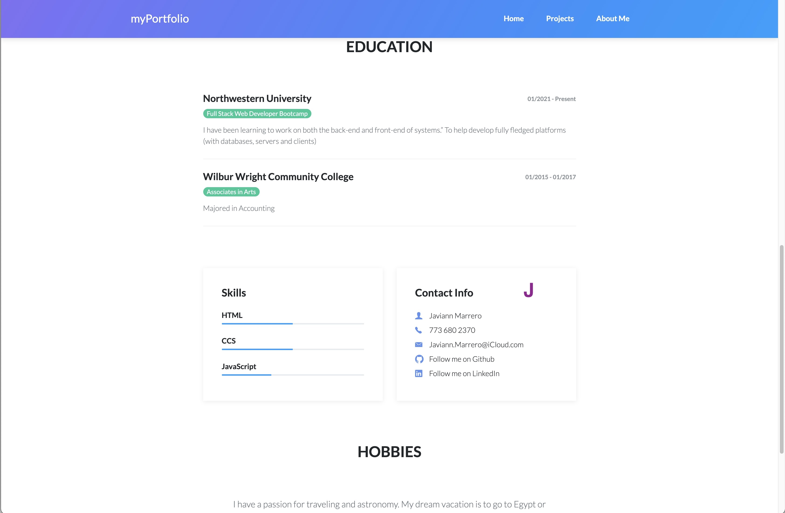

# updatePortfolio

# myPortfolio

My updated portfolio allows a users to find where to best contact me and view what projects i recentle been working on.

## Created by
* [Javiann Marrero](https://github.com/javiistacks)

## Table of Contents
* [myPortfolio Demos](#myPortfolio-demos)
* [Development](#development)
* [Deployment](#deployment)

## myPortfolio Demos

### Display on wide screen

### Display on mobile

## Screenshots of My Portfolio

A. On the top Nav bar you will find links that will navigate the user to different pages. Depending on what information they want to find out about me. 

B. The contact me link will navigate the user to my aboutMe.html.

C. I listed all the languages we are learning in the bootcamp plus a brief description of what they all do. 

D. On the home page you will a picture of my first project and link to deployed website. 

E. Every page has a footer which will help the user navigate to other pages in my portfolio. It also has social media icon that will direct user to my guthub account and linkedin. 

F. By clicking on the picture it will navigate the user to the deployed website. 

G. By clicking on the name of the project it will take the user to that projects repository. 

H. I added a link that will enable the user to download my resume. 

I. I listed my previous work and education for the user can understand my work experience and education. 

J. In my contact info you can find where to follow me on linkedin, github, email and phone number. 

## Development

### Bootstrap
* [Bootstrap](https://getbootstrap.com/)
  * Bootstrap was used for layout and mobile responsivess

### Github Repository
Site repository at [myPortfolio](https://github.com/javiistacks/updatePortfolio)

## Deployment
Site deployed at [myPortfolio](https://javiistacks.github.io/updatePortfolio/)

## License

Copyright (c) Javiann Marerro. All rights reserved. 
Please be kind and change content if you wish to use this code.

Licensed under the MIT License

Copyright (c) 2021 - present | Javiann Marerro

<blockquote>
Permission is hereby granted, free of charge, to any person obtaining a copy
of this software and associated documentation files (the "Software"), to deal
in the Software without restriction, including without limitation the rights
to use, copy, modify, merge, publish, distribute, sublicense, and/or sell
copies of the Software, and to permit persons to whom the Software is
furnished to do so, subject to the following conditions:

The above copyright notice and this permission notice shall be included in all
copies or substantial portions of the Software.

THE SOFTWARE IS PROVIDED "AS IS", WITHOUT WARRANTY OF ANY KIND, EXPRESS OR
IMPLIED, INCLUDING BUT NOT LIMITED TO THE WARRANTIES OF MERCHANTABILITY,
FITNESS FOR A PARTICULAR PURPOSE AND NONINFRINGEMENT. IN NO EVENT SHALL THE
AUTHORS OR COPYRIGHT HOLDERS BE LIABLE FOR ANY CLAIM, DAMAGES OR OTHER
LIABILITY, WHETHER IN AN ACTION OF CONTRACT, TORT OR OTHERWISE, ARISING FROM,
OUT OF OR IN CONNECTION WITH THE SOFTWARE OR THE USE OR OTHER DEALINGS IN THE
SOFTWARE.
</blockquote>

